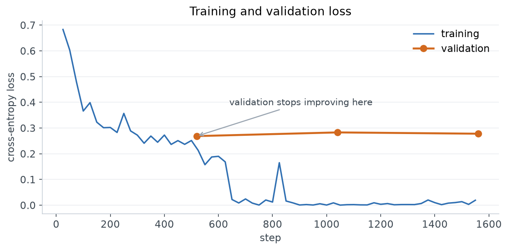
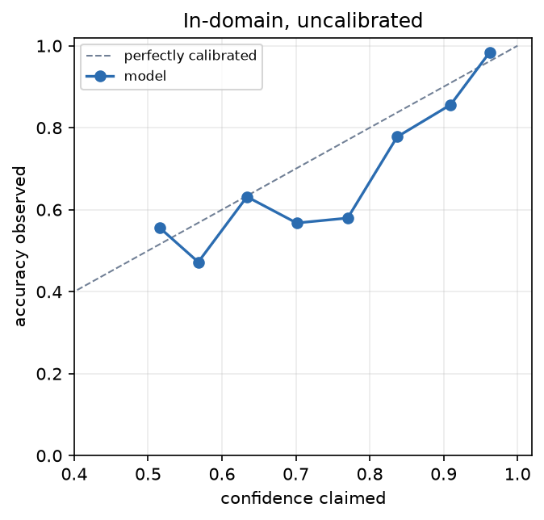

# Claim detection

An API that decides whether a sentence contains a factual claim — something a
fact-checker could go and verify. Not whether it's true.

> "The unemployment rate fell to 3.5% last year." → claim
> "I think we should lower taxes." → not a claim

Fact-checking a single claim takes a human hours, so the point of this is triage:
filter a stream of text down to the sentences worth someone's time.

Live at **https://claim-detection.fly.dev**

```bash
curl -X POST https://claim-detection.fly.dev/v1/detect \
  -H 'Content-Type: application/json' \
  -H 'Idempotency-Key: demo-1' \
  -d '{"sentences":["The unemployment rate fell to 3.5% last year."]}'
```

```json
{"results":[{"is_claim":true,"confidence":0.9809}],
 "model_version":"bert-seed42","threshold":0.35,"latency_ms":41.2}
```

---

## Results

BERT-base fine-tuned on 12,997 human-labelled sentences, frozen 80/20 split.
Trained on an M1 laptop in 25 minutes, no GPU.

| | accuracy | precision | recall | F1 |
|---|---|---|---|---|
| TF-IDF + logistic regression | 0.849 | 0.852 | 0.819 | 0.835 |
| **BERT-base fine-tuned** | **0.911** | **0.937** | 0.867 | **0.901** |

The baseline is there on purpose. A bag of words gets within seven points of a
transformer, which is worth knowing before anyone reaches for something bigger.

### Validation says three epochs was two too many



Validation loss stops improving after epoch 1 while training loss keeps falling.
Accuracy across all three epochs moves 0.4 points, well inside the ±0.9 point
standard error on 1,040 rows — so this is "converged", not a dramatic overfit,
but there's no case for training longer.

---

## The part that matters

The model scores 0.911 in domain. On tweets it collapses.

| | accuracy | F1 | says "claim" |
|---|---|---|---|
| BERT on tweets | 0.638 | 0.776 | 98% |
| answering "claim" to everything | 0.630 | 0.773 | 100% |

It doesn't degrade. It stops discriminating, and lands on the score of a
constant. F1 hides this completely — 0.901 → 0.776 reads like acceptable decay,
but 0.773 *is* the constant classifier, because recall going to 1.0 props F1 up
while precision decays to the base rate.

Every results table in this repo carries an all-positive baseline row for
exactly that reason.

### Three checks for why

**It isn't the threshold.**


Training data is 47.8% positive, tweets are 63%, so prior mismatch is the
obvious suspect. Sweeping the decision boundary from 0.05 to 0.95 moves accuracy
0.4 points and the model still says "claim" to 98% of tweets. Even demanding 95%
confidence barely changes anything.

**It isn't unfamiliar text.**


Mahalanobis distance over the pooled encoder embeddings, fitted on training
data. **AUROC 0.47** — worse than a coin flip. Tweets sit no further from the
training distribution than in-domain test rows do. The model doesn't find them
strange at all, which is why nothing internal flags the failure.

**It's the data.**

| source | rows | % positive |
|---|---|---|
| ClaimBuster — debate transcripts | 7,976 | 25.0 |
| PoliClaim — political speeches | 1,953 | 59.1 |
| AVeriTeC — published fact-checks | 3,068 | **100.0** |

A quarter of the training data has no negative examples, because AVeriTeC was
built from claims that had already been fact-checked. Source and label are
entangled before training starts.

The released split files are `text,label` only, so this isn't visible from the
data as given. `data.py` recovers provenance by matching each row back to its
original corpus on exact text — 12,996 of 12,997.


**And the TF-IDF baseline collapses the same way**, which rules out the
architecture. This is a property of the dataset, not of BERT.

### Ablation: retrain without AVeriTeC

| trained on | tweets accuracy | says "claim" | test accuracy |
|---|---|---|---|
| all three corpora | 0.638 | 98.8% | 0.909 |
| without AVeriTeC | 0.662 | 94.4% | 0.901 |

Out-of-domain improves 2.4 points and the model gets less indiscriminate. But
the standard error on 911 rows is 1.6 points, so that's about 1.5 SE —
suggestive, not significant, and still level with the baseline.

Two things move together here: dropping AVeriTeC also shifts the training
positive rate from 48.1% to 31.9%, so this doesn't isolate which one caused the
change. **Entanglement is part of it, not the whole cause.**

---

## Confidence

The endpoint returns a confidence, and a raw softmax maximum isn't one. Fitted
on a calibration split held out of training:

| | ECE | Brier | accuracy |
|---|---|---|---|
| uncalibrated | 0.049 | 0.071 | 0.911 |
| temperature (T=1.45) | 0.039 | 0.067 | 0.911 |
| Platt | 0.039 | 0.066 | 0.911 |
| isotonic | 0.021 | 0.066 | 0.909 |



Temperature scaling divides both logits by the same number, so it can't change
which class wins — accuracy is identical to the decimal. It makes the number
honest, not the model better. Platt adds a bias term that *can* move the
boundary, but that job is already done by tuning the threshold on validation, so
it gains nothing here.

The API serves the calibrated probability. T=1.45 means the raw model was
overconfident.

**Out of domain, ECE is 0.34** — it claims 98% confidence and is right 64% of
the time. That's the number that makes the failure concrete.

---

## Serving

```
        ┌─────────┐
client →│  nginx  │→ api ×2 ─── publish ──→ ┌──────┐
        └─────────┘     │                   │ NATS │
                        │                   └──────┘
                   run the model                 ↑
                        │                   worker ×2
                        ↓                        │
                    response ←──── results ──────┘
```

**Two paths.** `/v1/detect` answers inline in ~40ms. `/v1/jobs` hands back a
ticket for work that outlives an HTTP connection — 50,000 sentences shouldn't
hold a socket open for ten minutes.

**Both publish to NATS before running the model.** That ordering is the whole
durability guarantee: if the container dies mid-inference, the message is still
in the stream and a worker finishes it. Reverse those two lines and nothing else
in the design matters.

**The claim is narrower than "no request is ever lost".** It's: *once we return
a status code, the work is durable.* Before that, the client owns the retry —
which is why the idempotency key is client-generated. A server-assigned id is
useless if the response never arrived.

**Results live in a JetStream KV bucket** keyed by the idempotency key, so a
retry returns the stored answer instead of recomputing. Keys are hashed before
storage — JetStream KV only accepts a narrow character set, and a client sending
a key with a space shouldn't get a 500.

**No leases or heartbeats.** A worker holds an unacked message over a live
connection; if it dies, the socket closes and NATS redelivers. Doing this in
Postgres means inventing lease timeouts, heartbeat loops and fencing tokens, and
guessing a number against your longest job.

**Dynamic batching.** Requests arriving within 5ms are coalesced into one
forward pass. 64 concurrent calls become 2 forward passes rather than 64.

### Measured

Chaos test — submit jobs while randomly killing workers mid-flight:

```
accepted   500
completed  500
lost         0
```

The drain stalls partway before finishing. That gap is JetStream's ack timeout
expiring on messages held by a killed worker, then redelivering them. The stall
is the recovery working, not a hang.

Load:

```
c=1     18 req/s   p50  52ms
c=8     63 req/s   p50 141ms
c=32   100 req/s   p50 301ms   ← knee
c=64   108 req/s   p50 490ms
```

Zero errors at every level. Past 32 concurrent you buy 8% throughput for 60%
latency, so Fly's soft limit is set to 24 — it starts another machine instead of
letting latency climb.

---

## Running it

```bash
docker compose up --build
```

nginx on :8080, two API replicas, two workers, one NATS node with JetStream on a
named volume.

Deployment and scaling: [deployment/DEPLOY.md](deployment/DEPLOY.md)

### Training

```bash
python -m finetuning.baseline                                    # tf-idf floor
python -m finetuning.train --model bert --max-length 64 --epochs 3
python -m finetuning.export                                      # temperature + threshold
```

Training writes logits and pooled embeddings per split, so all analysis runs on
saved arrays and changing a metric never costs a retrain.

`finetuning/01_train.ipynb` covers the data and training.
`finetuning/02_analysis.ipynb` covers everything in the results section above.

---

## Layout

```
finetuning/     data, training, metrics, calibration, OOD, notebooks
deployment/     API, worker, queue, batcher, nginx, durability tests
artifacts/      figures and saved arrays
```

Model weights aren't in git. Train locally with the command above, or pull the
image which has them baked in.

## What I'd do next

- **Three NATS nodes.** One is a single point of failure — if it's down the API
  can't accept anything, because accepting *means* writing to it. `replicas=3`
  uses Raft, so losing a node is survivable.
- **Isolate the ablation.** Downsample AVeriTeC instead of dropping it, holding
  the positive rate fixed, to separate corpus effect from prior shift.
- **Multiple seeds.** Every number here is one run. Nothing has error bars.
- **ONNX INT8.** The model is fp32 torch on CPU; quantised ONNX would cut
  latency meaningfully and the parity check is cheap.
- **Fix the source of the problem.** The real answer to the transfer failure is
  training data that spans domains, not a better decoder on top of data that
  doesn't.

## Reference

Bell, A. (2025). *Less Can be More: An Empirical Evaluation of Small and Large
Language Models for Sentence-level Claim Detection.* FEVER workshop, ACL.
Dataset and frozen splits from
[VeritaResearch/claim-extraction](https://github.com/VeritaResearch/claim-extraction).
