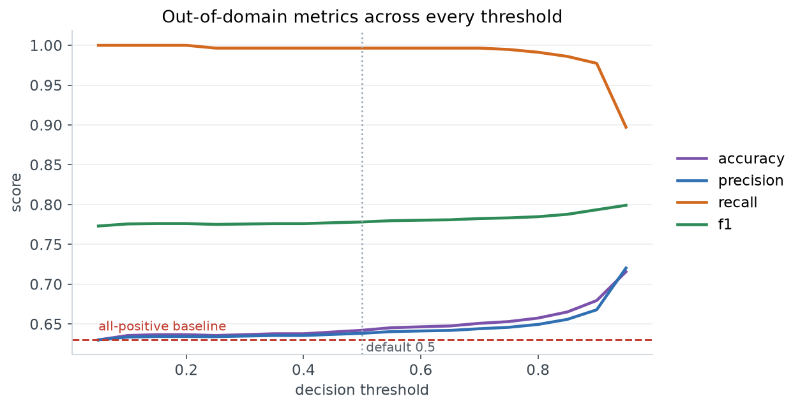
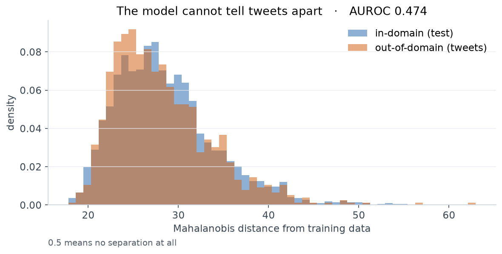
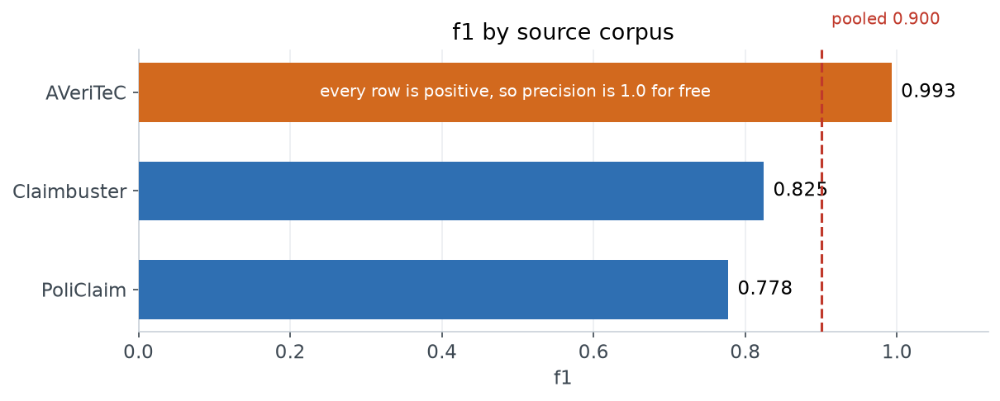
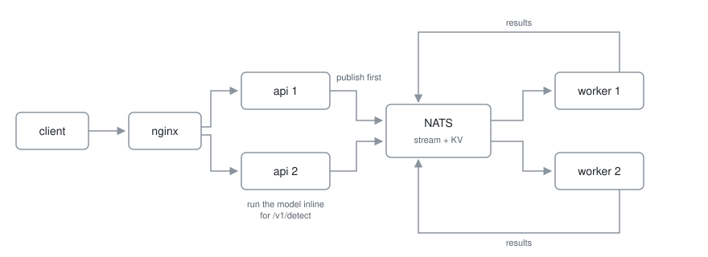

# Claim detection

Decides whether a sentence contains something a fact-checker could verify.
Not whether it's true.

> "The unemployment rate fell to 3.5% last year." → claim
> "I think we should lower taxes." → not a claim

Live at **https://claim-detection.fly.dev**

```bash
curl -X POST https://claim-detection.fly.dev/v1/detect \
  -H 'Content-Type: application/json' -H 'Idempotency-Key: demo-1' \
  -d '{"sentences":["The unemployment rate fell to 3.5% last year."]}'
```

## Results

BERT-base fine-tuned on 12,997 labelled sentences. 25 minutes on an M1, no GPU.

| | accuracy | F1 |
|---|---|---|
| TF-IDF + logistic regression | 0.849 | 0.835 |
| **BERT-base fine-tuned** | **0.911** | **0.901** |

## It collapses out of domain

| on tweets | accuracy | F1 | says "claim" |
|---|---|---|---|
| BERT | 0.638 | 0.776 | 98% |
| answering "claim" to everything | 0.630 | 0.773 | 100% |

It doesn't degrade, it stops discriminating — and lands on the score of a
constant. F1 hides it, because recall going to 1.0 props F1 up while precision
falls to the base rate. Every table here carries an all-positive row for that
reason.

**The threshold helps, but nowhere near enough.** Sweeping it on calibrated
probabilities takes accuracy from 0.630 to 0.716 — but only at 0.95, where you
are demanding near-certainty, recall drops to 0.897 and it still calls 78% of
tweets a claim. F1 moves 0.773 → 0.799. Against 0.911 in domain, that is not a
fix, and the operating point it needs is one you would never actually ship.



**Not unfamiliar text.** Mahalanobis distance over the embeddings gives AUROC
**0.47** — worse than chance. The model doesn't find tweets strange, which is
why nothing internal flags the failure.



**It's the data.** AVeriTeC is 3,068 of the rows and *every one is positive*,
because it was built from claims already fact-checked. Source and label are
entangled. The released splits are `text,label` only, so this isn't visible —
`data.py` recovers provenance by exact-matching each row to its corpus,
12,996 of 12,997.



Read that AVeriTeC bar carefully: it has no negative rows, so precision is 1.0
for any model that predicts positive at all, and F1 is inflated by construction.
The comparison that means something is Claimbuster 0.825 against PoliClaim 0.778
— and that the ablated model still scores 0.937 accuracy on AVeriTeC having
never trained on it.

The TF-IDF baseline collapses identically, which rules out the architecture.

**Ablation.** Retraining without AVeriTeC moves tweets 0.638 → 0.662 and drops
"says claim" from 98.8% to 94.4%. Standard error on 911 rows is 1.6 points, so
that's ~1.5 SE — suggestive, not significant. It also shifts the positive rate
48% → 32%, so it doesn't isolate the cause. Part of it, not all of it.

## Confidence

| | ECE | accuracy |
|---|---|---|
| uncalibrated | 0.049 | 0.911 |
| temperature (T=1.45) | 0.039 | 0.911 |
| isotonic | 0.021 | 0.909 |

Temperature divides both logits by the same number, so it can't flip a
prediction — accuracy is identical. It makes the number honest, not the model
better. The API serves the calibrated probability.

**On tweets ECE is 0.34**: it claims 98% confidence and is right 64% of the time.

## Serving



`/v1/detect` answers inline in ~40ms. `/v1/jobs` returns a ticket for work that
outlives an HTTP connection.

**Both publish to NATS before running the model.** That ordering is the whole
guarantee — if the container dies mid-inference the message is still in the
stream and a worker finishes it.

The claim is narrower than "nothing is ever lost": *once we return a status
code, the work is durable.* Before that the client owns the retry, which is why
the idempotency key is client-generated.

No leases or heartbeats — a worker holds an unacked message over a live
connection, and if it dies the socket closes and NATS redelivers. Results go in
a KV bucket keyed by the idempotency key, so a retry returns the stored answer.

Requests arriving within 5ms are batched into one forward pass.

### Measured

Killing workers mid-flight: **500 accepted, 500 completed, 0 lost.**

```
c=1     18 req/s   p50  52ms
c=32   100 req/s   p50 301ms   ← knee
c=64   108 req/s   p50 490ms
```

Zero errors at every level.

## Running it

```bash
docker compose up --build
```

```bash
python -m finetuning.train --model bert --max-length 64 --epochs 3
python -m finetuning.export
```

Training dumps logits and embeddings per split, so analysis never costs a
retrain. Notebooks: `01_train` for data and training, `02_analysis` for
everything above. Deployment: [deployment/DEPLOY.md](deployment/DEPLOY.md).

## What's missing

- **One NATS node is a single point of failure.** If it's down the API can't
  accept anything, because accepting means writing to it. `replicas=3` fixes it.
- Ablation doesn't isolate its variable — should downsample, not drop.
- One seed. Nothing has error bars.
- fp32 torch on CPU; ONNX INT8 would cut latency.

## Reference

Bell, A. (2025). *Less Can be More.* FEVER workshop, ACL. Splits from
[VeritaResearch/claim-extraction](https://github.com/VeritaResearch/claim-extraction).
